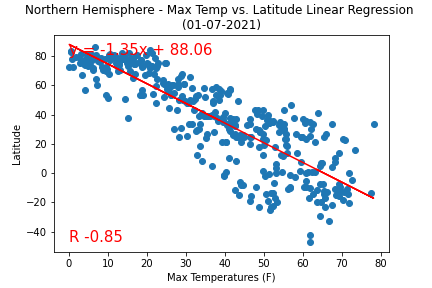
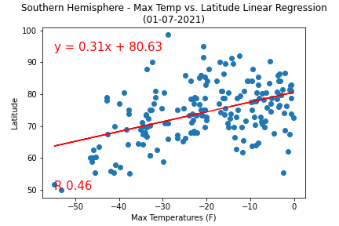
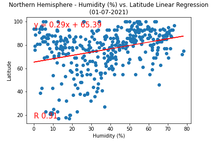
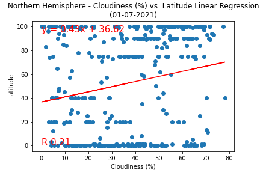
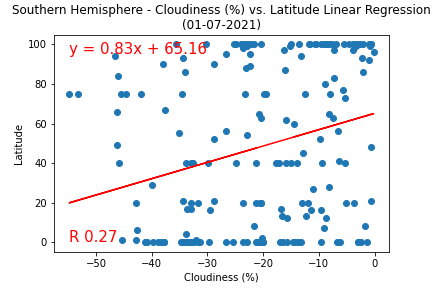
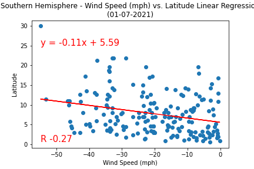

# Python API Homework - What's the Weather Like?

## Background

Whether financial, political, or social -- data's true power lies in its ability to answer questions definitively. So let's take what you've learned about Python requests, APIs, and JSON traversals to answer a fundamental question: "What's the weather like as we approach the equator?"

Now, we know what you may be thinking: _"Duh. It gets hotter..."_

But, if pressed, how would you **prove** it?


## Part I - WeatherPy

## Observations
### Strongest negative correlation
#### Northern Hemisphere - Temperature (F) vs. Latitude

The max temperatures (F) (y-axis) are highest closest to the equator (latitue 0). As you get farther away from the equator (higher latitude value, x-axis), the max temperatures (F) decrease. 



### Strongest positive correlation
#### Southern Hemisphere - Temperature (F) vs. Latitude

The temperatures (F) (y-axis) are lowest farther away from the equator (latitue 0). As you get closer to the equator (higher latitude value, x-axis), the max temperature (F) increases. 




Use WeatherPy python script to visualize the weather of 500+ cities across the world of varying distance from the equator. [CityPy library](https://pypi.python.org/pypi/citipy) and [OpenWeatherMap API](https://openweathermap.org/api) were utilized to generate retrieve random list of cites, associated weather data and create a representative model of weather across world cities.

Series of scatter plots are created to showcase the following relationships:

* Temperature (F) vs. Latitude
  - 
  - Latitude vs. Temerature (F) scatter plot shows temperatures rising as you get closer to zero degrees latitude (equator), then as the latitude values increase greater than zero (increasing further from the equator), the temperature decreases steadily.
* Humidity (%) vs. Latitude
  - 
  - Latitude vs. Humidity (%) scatter plot does not appear to show a strong correlation.
* Cloudiness (%) vs. Latitude
  - 
  - Latitude vs. Cloudiness (%) scatter plot does not appear to show a strong correlation.
* Wind Speed (mph) vs. Latitude
  - 
  - Latitude vs. Wind Speed scatter plot does not appear to show a strong correlation.

After each plot, explaination of what the code is analyzing is included.

Next, city weather data is separated into northern hemisphere (greater than or equal to 0 degrees latitude) and southern hemisphere (less than 0 degrees latitude). Linear regressions were run on each relationship. After each plot, explaination of linear regression modeling is included.

* Northern Hemisphere - Temperature (F) vs. Latitude
  -  
  - Strong negative correlation coefficient (r value). In the northern hemisphere, the farther you are in degrees latitude from the equator, the temperature decreases steadily.
* Southern Hemisphere - Temperature (F) vs. Latitude
  - 
  - Moderate positive correlation coefficient (r value). In the southern hemisphere, the closer you are in degrees latitude to the equator, the temperature increases moderately.
* Northern Hemisphere - Humidity (%) vs. Latitude
  - 
  - Moderate positive correlation coefficient (r value). In the northern hemisphere, the farther you are in degrees latitude from the equator, the percent humidity increases moderately.
* Southern Hemisphere - Humidity (%) vs. Latitude
  - 
  - Moderate positive correlation coefficient (r value). In the southern hemisphere, the closer you are in degrees latitude to the equator, the percent humidity increases moderately.
* Northern Hemisphere - Cloudiness (%) vs. Latitude
  - 
  - Weak positive correlation coefficient (r value). In the northern hemisphere, the farther you are in degrees latitude from the equator, the percent cloudiness increases slightly.
* Southern Hemisphere - Cloudiness (%) vs. Latitude
  - 
  - Weak positive correlation coefficient (r value). In the southern hemisphere, the closer you are in degrees latitude to the equator, the percent cloudiness increases slightly.
* Northern Hemisphere - Wind Speed (mph) vs. Latitude
  - 
  - Very weak positive correlation coefficient (r value). In the northern hemisphere, the farther you are in degrees latitude from the equator, the wind speed (mph) increases very slightly.
* Southern Hemisphere - Wind Speed (mph) vs. Latitude
  - 
  - Weak negative correlation coefficient (r value). In the southern hemisphere, the closer you are in degrees latitude to the equator, the wind speed (mph) decreases slightly.

Final notebook includes:

* Randomly select **at least** 500 unique (non-repeat) cities based on latitude and longitude. Use get_cities(mincitycount) to retrive cities where mincitycount is the (int) minimum city count get_cities will retrieve.
* Perform a weather check on each of the cities using a series of successive API calls.
* Include a print log of each city as it's being processed with the city number and city name.
* Save a CSV of all retrieved data and a PNG image for each scatter plot.

### Part II - VacationPy

Now let's use our weather data to plan future vacations. Google Places API and jupyter-gmaps were used for this part the project.

VacationPy includes: 

* A heat map that displays the humidity for every city from Part I - WeatherPy.

  

* Dataframe narrowed down to ideal weather conditions:

  * A max temperature lower than 80 degrees but higher than 70.

  * Wind speed less than 10 mph.

  * Less than or equal to 15% cloudiness.

* Google Places API was used to find the first hotel for each city located within 5000 meters of the cities with ideal weather conditions.

* Hotels layer plot on top of the humidity heatmap with each hotel containing the **Hotel Name**, **City**, and **Country**.

  

As final considerations:

* Analysis completed using a Jupyter notebook.
* Matplotlib plotting libraries.
* For Part I, written description of three observable trends based on the data.
* For Part II, screenshots of the heatmap and hotels gmaps layers.
* Plot labels including: Plot Titles (with date of analysis) and Axes Labels.

### Other Notes and Considerations

* The city data generated is based on random coordinates as well as different query times. As such, outputs will not be an exact match.

* Geographic coordinate system, [this site](http://desktop.arcgis.com/en/arcmap/10.3/guide-books/map-projections/about-geographic-coordinate-systems.htm) is a great reference.

* Open Weather
  * Where do you request the API key?  [Signup for OpenWeather](https://home.openweathermap.org/users/sign_up)
  
  * Which Weather API in particular will you need? 

    API call: api.openweathermap.org/data/2.5/weather?

  * What URL endpoints does it expect? q={city name}&appid={API key}
  
  * What JSON structure does it respond with? 
  
  ```Index 0 fetching weather for San Diego
      [{'base': 'stations',
        'clouds': {'all': 75},
        'cod': 200,
        'coord': {'lat': 32.72, 'lon': -117.16},
        'dt': 1609811275,
        'id': 5391811,
        'main': {'feels_like': 52.43,
                'humidity': 72,
                'pressure': 1022,
                'temp': 55.8,
                'temp_max': 60.01,
                'temp_min': 53.6},
        'name': 'San Diego',
        'sys': {'country': 'US',
                'id': 5771,
                'sunrise': 1609771885,
                'sunset': 1609808147,
                'type': 1},
        'timezone': -28800,
        'visibility': 10000,
        'weather': [{'description': 'broken clouds',
                    'icon': '04n',
                    'id': 803,
                    'main': 'Clouds'}],
        'wind': {'deg': 10, 'speed': 4.7}}]
  ```


* Citipy was utilized to generate list of random cities [citipy Python library](https://pypi.python.org/pypi/citipy).

* Thorough README.md file.